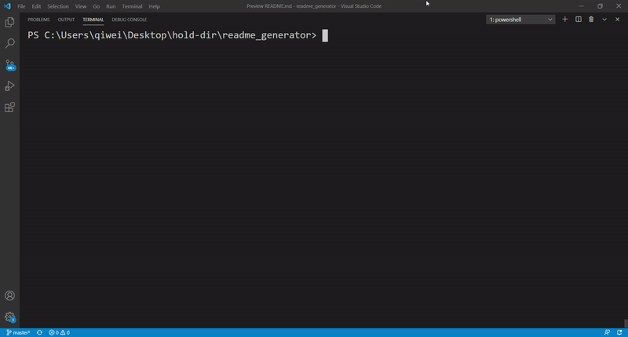

# Good Readme Generator

## Description
This app generates a README.md file based off of user inputs. It operates in NODE.js and utilizes the inquirer NPM.
## Table of Contents
* [Installation](#installation)
* [Usage](#usage)
* [License](#license)
* [Contributing](#contributing)
* [Tests](#tests)
* [Questions](#questions)
## Installation
To install the app, simply copy the index.js and package.json files to your local computer. Once the files are copied, open your terminal and go to directory where your files are saved.  Type in "npm install" and your environment is set.
## Usage
Once your environment is setup, simply type in "node index.js" in your terminal. You will be prompted with a series of questions. Answer all of the questions and your README.md will generate in the same directory as your index.js.

## License
MIT
## Contributing
Contributors are welcome. Please feel free to reach out to me before contributing.
## Tests
Pending
## Questions
If you have any questions regarding this project, please email me at: qiwei.mod@gmail.com
